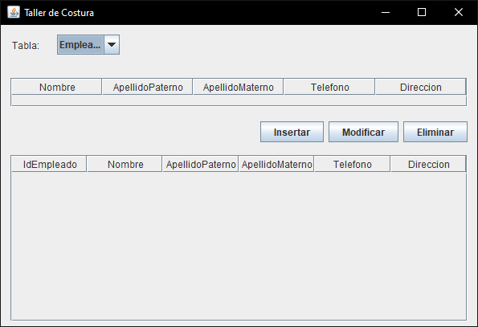

# BOGA Postgres SQL DBMS

Built for Taller Boga business with the required metadata, to store and retrieve
all the clients data and transactions. Made in Java, with JFrame class and external 
Postgres lib. Compiled with Netbeans IDE.

Its required to have latest Postgres installed in order to work

In TallerCosturaPostgres.sql file is located the construction of the 
database, including all tables and some optimization
and prevention triggers for the database. Must build in the specified order

## Screenshots

